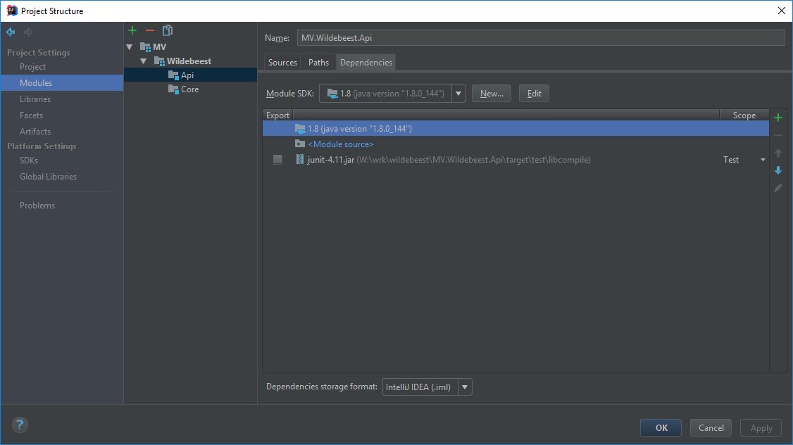
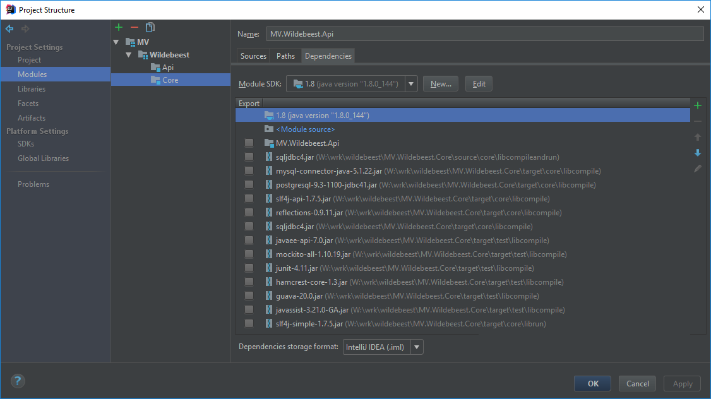

# Developer Guide

## Introduction

This document will get you started on building and hacking on Wildebeest.

## Toolchain

The mandatory tools for working on Wildebeest are:

- JDK 1.8 or later
- Any text editor
- A vanilla installation of [Apache Ant](https://ant.apache.org/) 1.8.2 or later

If you want to use an IDE, we recommend using the latest version of IntelliJ.  IntelliJ project files are included.

Regardless of your choice of editor please ensure you configure it to follow our [code standard](Code Standard.md).

We support development on Linux, Windows and macOS.  For guidance on setting up the required tools, see **Toolchain Setup** below.

## Get the Code

If you just want to play with the Wildebeest code, you can clone directly from the main repository

```
git clone https://github.com/mathesonventures/wildebeest.git
```

However if you want to start making code changes to submit back to the project, you will need to first fork the project into your own account on GitHub, then clone from your fork.  It is recommended that you create a feature branch in your fork to contain each feature that you work on, and that you submit pull requests to the main repo from a feature branch.

## Command-Line Quick Start

### Introduction

The most lightweight way to get started is using your command-line tools to build and test Wildebeest.

### Build the API Component

The API component defines a number of interfaces and types that are used by the Core of Wildebeest, and must be built first.  This can be done using Ant as follows:

```
$ cd MV.Wildebeest.Api
$ ant core.jar:pub-project
```

The Ant-based build will retrieve dependencies, compile the code and build a JAR, and publish it to a project-level repository called /repo/ in the root of the project.

Now you can move to the Core component and build it:

```
$ cd ../MV.Wildebeest.Core
$ ant core.jar:pub-project
```

This does the same thing for Core as we just did for API, building and publishing a JAR artifact into the project-level repository at /repo/

You can also run the test suite for Core while you're here:

```
$ ant test.app:report
```

The test report is placed in /target/test/report.

### Cleaning Up

You can clean up the build for each component separately by running the "clean" Ant target:

```
$ ant clean
```

From either component you can also purge the project-level artifact repository using the cleanrepo target:

```
$ ant cleanrepo
```

## IntelliJ Quick Start

### Introduction

This project is setup to require the minimal - actually no - special configuration in your IDE.

The main way this is achieved is by resolving all dependencies from the project itself - not from globally defined libraries.  This slaves IntelliJ to our main build which is driven through Ant.  Similarly the file system structure for unit tests etc is managed by the Ant-driven build, and simply referenced from IntelliJ.

### Preparation

After checking out the code, you will need to run a couple of Ant targets to make sure that all dependencies are in place for IntelliJ to compile the code, and that all test files are in place for IntelliJ to run unit tests.  Therefore before opening the project in IntelliJ, in a shell run the following Ant targets.

First we use the "deps" target to pull down all dependencies for the MV.Wildebeest.Api component:

```
$ cd MV.Wildebeest.Api
$ ant deps
```

Next we do the same for MV.Wildebeest.Core, and we also run the test.app target to assemble the file structure required for unit tests:

```
$ cd ../MV.Wildebeest.Core
$ ant deps
$ ant test.app
```

### Building in IntelliJ

You can now open the project.  Launch IntelliJ and tell it to open from the root of the repository:


This will open up the project containing both modules - Api and Core.

The usual build actions will work now - for example you can right-click MV.Wildebeest.Api and choose Build or Rebuild, or you can use Ctrl+F9 to build.

Note there is a project-to-project reference configured so that MV.Wildebest.Core is linked to MV.Wildebeest.Api.  This allows you to refactor and compile across the projects without the need to republish the Api artifact in Ant as we did in the Command-Line Quick Start.

### Testing in IntelliJ

You can run tests in IntelliJ as normal, however you may need to first set the default base path so that tests can find the files from the test directory structure.  To make this setting in IntelliJ:

- Go to the Run menu and choose Edit Configurations.

- Expand the Defaults side navigation option and select JUnit

- In the settings pane, set Working Directory to \$MODULE_DIR\$\target\test\app


  

### Configuration Overview

To see the internals of how this configuration is setup:

- Go to File / Project Structure

- On the left navigation strip choose Modules, then in the next panel choose MV / Wildebeest / Api

- Choose the Dependencies tab.  Here you'll see that the JUnit JAR is referenced from the target/ directory structure that was created by our Ant build.  This is where Ant / Ivy placed the JAR when resolving dependencies:

  

  

  

- Also take a look at the Dependencies tab for the module MV / Wildebeest / Core.  This is similar, but there are just more dependencies.  All these dependencies come from the target/ directory structure except for MV.Wildebeest.Api which is a project reference as mentioned above.

  

  

  

While this configuration approach forces the extra step of running ant deps a couple of times, it also makes the project extremely portable as IntelliJ does not rely on you having any particular resources available on your development rig.

## Toolchain Setup

### JDK

Get the latest Java SE SDK from Oracle at http://www.oracle.com/technetwork/java/javase/downloads/index.html.  Choose the package appropriate for your OS and architecture and install it.

### Apache Ant

- Get the latest Ant ZIP distro from https://ant.apache.org/bindownload.cgi.
- Unpack it somewhere appropriate such as /opt/apache-ant on Linux or C:\opt\apache-ant on Windows.
- Define an environment variable called ANT_HOME set to that path.
- Add Ant to your path:
  - On Linux append $ANT_HOME/bin
  - On Windows append %ANT_HOME%/bin

### Pre-Flight Check

Before going back to hack on Wildebeest, make sure your tools are setup correctly:

```
$ javac -version
javac 1.8.0_144

$ java -version
java version "1.8.0_144"
Java(TM) SE Runtime Environment (build 1.8.0_144-b01)
Java HotSpot(TM) 64-Bit Server VM (build 25.144-b01, mixed mode)

$ ant -version
Apache Ant(TM) version 1.8.2 compiled on December 20 2010
```

### 